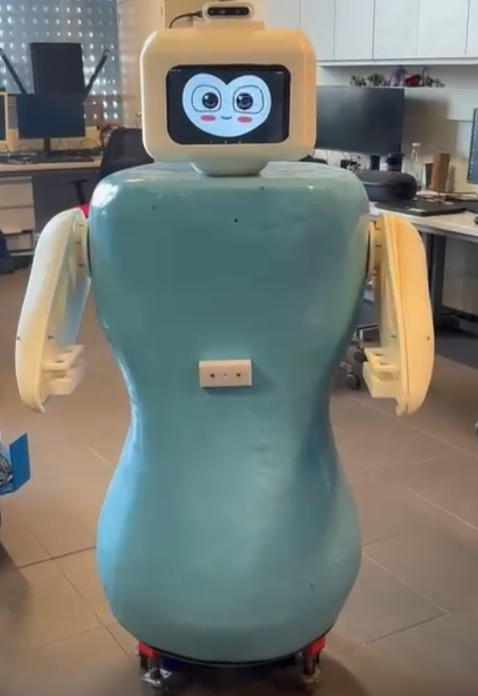

Path-Planning-and-Low-Level-Control

This repository holds my personal contributions to our Final Year Project (FYP), which is Developing Robot SHARE-C's Full Autonomy, with an emphasis on path planning and low-level control.

The system was developed mainly on an NVIDIA Jetson TX2 and an Arduino Mega, communicating using rosserial on ROS Melodic.

My work involved:

 - Configuring and calibrating the `move_base`
 navigation stack, which is complemented by the use of RTAB-MAP SLAM
 for perception and localization.

 - Creating low-level PID motor controllers on the Arduino.

 - Incorporating keyboard teleoperation for manual control.

 - Developing a custom battery monitoring node to estimate and publish battery percentage from raw sensor voltage data.

**Note**: Only the components I directly developed are included in this repository. My teammates worked on the other aspects of the project (e.g., SLAM implementation, GUI, or mechanical design).

## 📌 Poster Preview

## 🤖 Robot – SHARE-C

## 📹 Video Demonstration

The following link : https://youtu.be/2a8PZjOhHwQ Video showcasing the motivation and demonstration of this project 
